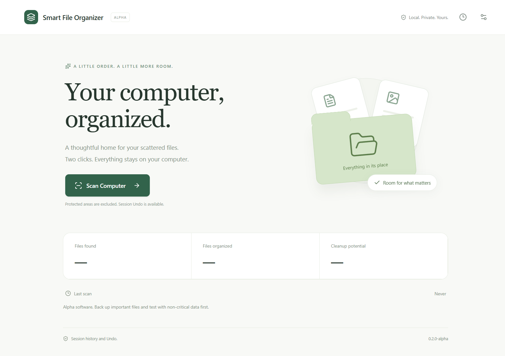
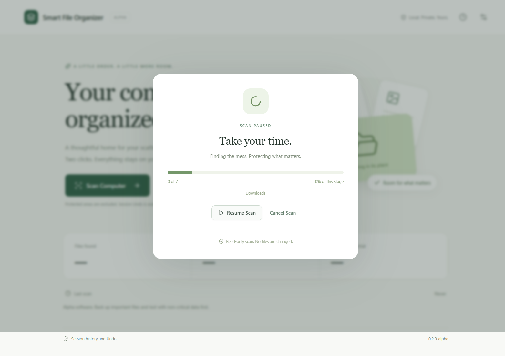
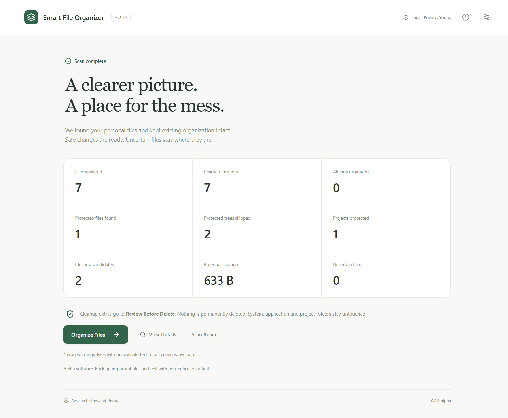
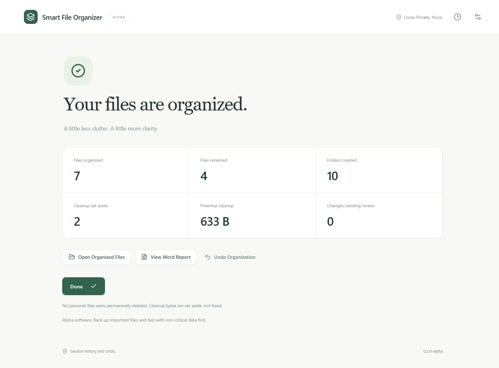
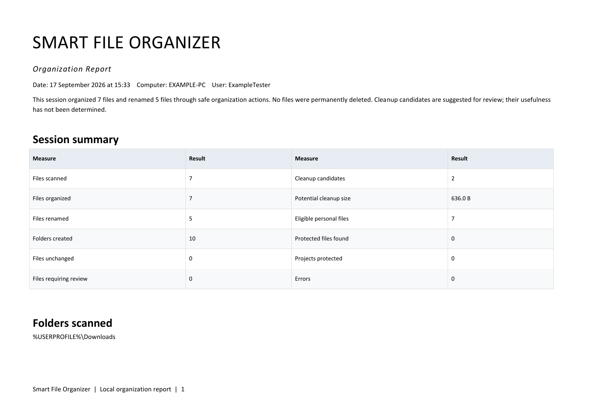

<div align="center">

# Smart File Organizer

**Two clicks from messy to organized.**

**SCAN COMPUTER → ORGANIZE FILES → DONE**

A local-first Windows app that scans, classifies, renames and organizes scattered files, with cleanup review and session Undo.


[](LICENSE)



</div>

**Alpha software:** this app changes file locations and names. Back up important files and start in a disposable Windows account or VM with non-critical data. Protections and Undo reduce risk; bugs can still occur.

## Download and start

Open [GitHub Releases](https://github.com/leechunteck2007-max/smart-file-organizer/releases) and select **v0.2.0-alpha**. Download `SmartFileOrganizer-v0.2.0-alpha-Windows-x64.zip`, extract the entire folder, then run `SmartFileOrganizer.exe`. Keep the runtime files beside it. No Python, Node.js, Git or development tools are required. The build is unsigned; Windows may display its unknown-publisher warning. A Word-compatible viewer is needed to open DOCX reports.

1. Click **Scan Computer**. The scan reads files without moving them; you can pause or cancel.
2. Read the summary, then click **Organize Files**. This authorizes automatic eligible moves, renames and cleanup quarantine.
3. Open organized files, view the Word report, or use **Undo Organization** from the result or history.

There is no mandatory per-file approval step. To limit a trial, use Settings to exclude folders and drives, or use a disposable profile. The default library is `%USERPROFILE%\File Library`; other volumes receive a library on their own volume.

## What it does

| Feature | Current behavior |
| --- | --- |
| Storage discovery | Finds Windows known folders, accessible personal storage and eligible local drives. External-drive scanning can be disabled. Unknown-risk areas remain unchanged. |
| Smart organization | Local rules and bounded document inspection group eligible files into folders. Existing meaningful human organization is retained. |
| Conservative renaming | High-confidence evidence supports searchable names. Medium-confidence files retain their names and use broad categories; uncertain files stay put. |
| Project protection | Recognizes project and application markers and prunes their contents alongside protected Windows directories. |
| Cleanup review | Hash-confirmed duplicate extras and eligible cleanup candidates go to **Review Before Delete**. Quarantine does not free disk space. |
| Session Undo | Records operations before moving files; restores originals when destination bytes are unchanged and original paths are available. |
| Word reports | Generates a local DOCX summary and complete JSON appendix. Reports can contain private paths and document information. |

Classification and file operations run locally. The app has no cloud classifier, account requirement or telemetry uploader. See [Privacy](docs/PRIVACY.md).

## See the workflow

| Scan and analyze | Ready to organize |
| --- | --- |
|  |  |

| Organized | Word report |
| --- | --- |
|  |  |

All previews use generated examples and a fictional computer identity.

## Safety and limitations

The app does not intentionally permanently delete personal files. It uses same-volume, no-overwrite moves, validates source metadata and protections, and records rollback history. Locked, changed, linked, offline or unsafe files are skipped or reported. Cleanup usefulness is not guaranteed: inspect **Review Before Delete** yourself. Never remove application state while you still need Undo.

Undo refuses occupied original paths and changed files; it can be partial. This alpha does not provide a backup. Physical external drives and a second independent PC remain acceptance-test gaps. Large scans have explicit budgets; unsupported or unreadable content uses conservative fallback. See [Safety](docs/SAFETY.md) and [Known issues](KNOWN_ISSUES.md).

## How it works

Storage discovery → safety checks → read-only scan → local classification → conservative naming → organization and cleanup plan → journaled moves → history and Undo → DOCX report.

The desktop uses React, TypeScript and Electron. A separate Python process owns scanning, classification, SQLite history, file operations and report generation. See [Architecture](docs/ARCHITECTURE.md).

## Build from source

Windows x64, Python 3.13, Node.js 24, Git and pnpm 11.19.0 are used for release validation. Dependencies are pinned. Clone this repository with Git, then open PowerShell in its directory:

```powershell
git clone https://github.com/leechunteck2007-max/smart-file-organizer.git
Set-Location smart-file-organizer
python -m venv .venv
.\.venv\Scripts\python.exe -m pip install -r requirements.txt -r requirements-build.txt
npm install --global pnpm@11.19.0
pnpm --dir frontend install --frozen-lockfile
node frontend/node_modules/electron/install.js
Set-Location frontend
node --no-opt node_modules/typescript/bin/tsc --noEmit
node --no-opt node_modules/vite/bin/vite.js build
Set-Location ..
$env:SMART_PYTHON = (Resolve-Path .\.venv\Scripts\python.exe).Path
.\.venv\Scripts\python.exe main.py
```

The desktop launcher uses the built frontend. For frontend-only editing, `pnpm --dir frontend dev` runs a local preview; file operations require the Electron desktop. `--no-opt` avoids optimizer crashes encountered during validation and keeps WebAssembly enabled.

```powershell
.\.venv\Scripts\python.exe -m unittest discover -s tests -v
.\.venv\Scripts\python.exe scripts/release_check.py
.\.venv\Scripts\python.exe scripts/build_smart_portable.py
```

The builder runs all Python tests, TypeScript checks, frontend compilation, desktop integration tests, PyInstaller, standalone parser/report/UI checks and ZIP integrity checks. Its output is under `dist/`. Normal users download the ZIP instead.

## Contributing

Read [CONTRIBUTING.md](CONTRIBUTING.md), [SECURITY.md](SECURITY.md), [Code of Conduct](CODE_OF_CONDUCT.md) and [Testing](TESTING.md). Bugs and features use the repository's issue forms. **Never upload private files, unsanitized reports, local databases or sensitive filenames.**

See the [Roadmap](ROADMAP.md), [Changelog](CHANGELOG.md) and [Alpha release notes](docs/releases/v0.2.0-alpha.md).

## License

Original project code and documentation are [MIT licensed](LICENSE). Bundled components retain their own terms; see [Third-party notices](THIRD_PARTY_NOTICES.md).
