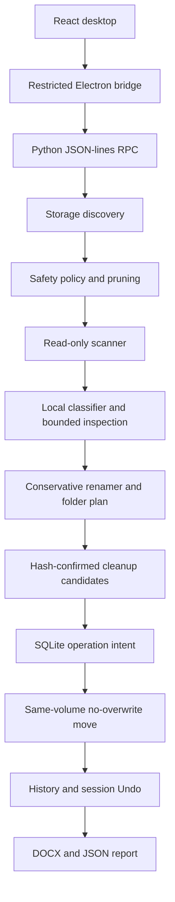

# Architecture

The Windows desktop is an Electron shell around a compiled React/TypeScript interface. Electron launches a separate Python engine. The packaged engine is frozen with PyInstaller; users need no development runtimes.

| Location | Responsibility |
| --- | --- |
| `frontend/src/` | Home, progress, summary, result, settings and history. |
| `frontend/electron/` | Sandboxed window, narrow preload bridge, RPC forwarding and native folder/report opening. |
| `smart_engine.py`, `app/smart_engine.py` | Engine entry point, serial operation worker and scan controls. |
| `app/smart/discovery.py`, `progressive.py` | Windows known folders/drive inventory and protected-tree pruning. |
| `app/safety/` | Path, project, application, link and write vetoes. |
| `app/smart/inspect.py`, `understand.py` | Bounded local extraction, rules, confidence and names. |
| `app/smart/v2.py` | Automatic scan/organization, cleanup, per-volume libraries and session operation history. |
| `app/smart/cleanup.py` | Cleanup evidence; duplicates require size and SHA-256 equality. |
| `app/actions/`, `app/database/`, `app/undo/` | Validated moves, durable SQLite intent and collision-safe Undo. |
| `app/smart/report.py` | Word summary and complete local JSON appendix. |
| `tests/`, `frontend/tests/` | Synthetic regression, safety and desktop integration coverage. |
| `scripts/` | Fixture generators, validation and Windows packaging. |

V2 builds on the existing SmartService. Earlier engine and GUI modules remain for regression coverage; the consumer launcher uses Electron. No cloud service participates.

The UI sends a scan token when organizing. Settings changes invalidate plans. The engine serializes operations; scan controls act at checkpoints. Moves write intent before mutation and attach actions to sessions for recovery. Content-cache rows store limited extracted text locally. See [Privacy](PRIVACY.md).
